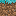

# Celestialic

A mod intending to add numerous fish mobs and boss, among other things.

\* = might be changed

# Future Plans

This is all that is currently planned for implementation, for now. I plan on implementing more features at a later time when all the current mentioned features are implemented.

## Mobs

---

### Koi

    Passive mob: a fish mob that can be red, yellow, white, or black, with markings of the same colors.

    Statistics:

    - 6 HP

    Spawn Location(s) :

    - River biomes\*
    - Colder River Biomes
    - Lakes\*

    Drops:

    - raw koi
    - cooked koi
    - heavenly scale\* : 1:1000 chance of dropping

### Aureate Koi

    Neutral mob: a golden koi with blue markings on its face.

    Statistics:

    - 10 HP
    - 3 AD

    Spawn Location:

    - Structure : golden pool\*
    - Biome : Frozen Peaks

    Drops:

    - Shimmering Scales : used to craft shimmering armor

### Yin and Yang Koi

    Passive/Neutral mob: the Yin and the Yang Koi resemble the symbol for yin and yang.

    Statistics:

    - Yin :
    - 14 HP
    - Yang :
    - 16 HP
    - 4 AD

    Spawn Location:

    - Structure : Celestial Pool
    - Biome : Grove (above a certain y-level)

    Drops:

    - TBD

### Aero Koi

    Hostile mob: a blue koi that flies, has light blue markings

    Statistics:

    - 6 HP
    - 2 AD

    Spawn Location:

    - Mountain Peek biomes above a certain y-level

    Drops:

    - TBD (has to do with slow falling/being able to move more easily in the air)

### Alizarin Koi\*

    Hostile mob: a massive red koi that flies, it is a boss mob that is summoned above a certain y-level and fires projectiles at the player as well as trying to bash the player.

    Statistics\*:

    - 250 HP
    - Attacks:
    - Long Range:
        - 4 AD
    - Bash Attack:
        - 10 AD

    Spawn Location:

    - Above a certain y-level while using the summoning method (TBD)

    Drops:

    - Heavenly Scales\*
    - Other items (TBD)

## Items

---

### Heavenly Scale 

    - Function: TBD

### Shimmering Scale

    - Function: used for crafting Shimmering Armor

### Shimmering Armor

    - Function: Makes Piglins neutral towards the player.
    - Statistics: Armor level stronger than gold but less than diamond.\*

### Raw Koi 

    - Function: food item dropped from koi.
    - Statistics: 2 hunger points, 0.2 saturation

### Cooked Koi 

    - Function: cooked food item obtained from raw koi.
    - Statistics: 6 hunger points, 7.8 saturation

## Blocks

---

### Celestial Grass  

    - Aquisition Method: Generated with Celestial Pools (other method TBD)
    - Functions: similar to grass, but can't spread and applies regeneration to an entity standing on top of it.
    - Other Information (TODO): Emits light and glows light lava.

### Shimmering Grass

    - Aquisition Method: Generated with golden pools (other method TBD)
